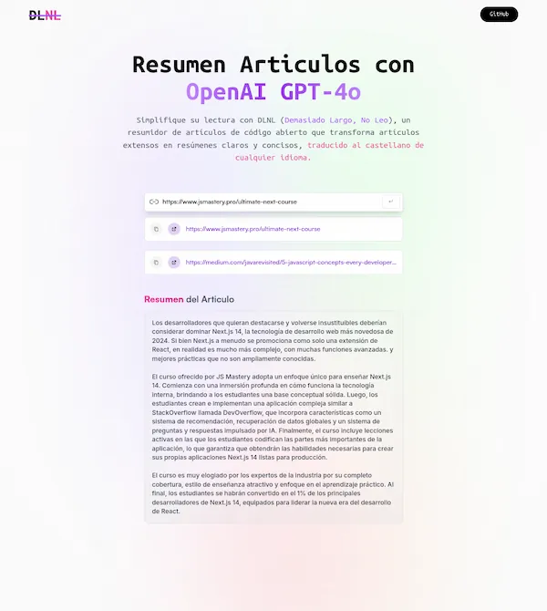

<div align="center">

<h2> 
<em>DLNL</em>, una herramienta para resumir y traducir artículos usando inteligencia artificial. 
</h2> 
<p> 
Proyecto creado en React con Vite, Redux y TailwindCSS, optimizado para manejar el estado de carga y errores. 
</p>

</div>

<div align="center"> 
<a href="#empezar"> Empezar </a> <span>&nbsp;✦&nbsp;</span> <a href="#comandos"> Comandos </a> 
</div> <p></p>

<div align="center"> 
 
</div>

## Stack

- [**React**](https://es.react.dev/) - Biblioteca de Javascript.
- [**Redux Toolki**](https://redux-toolkit.js.org/) - Conjunto de herramientas para gestionar el estado en aplicaciones React.
- [**TailwindCSS**](https://tailwindcss.com/) - Framework de CSS para el diseño rápido y personalizable.
- [**Vite**](https://vitejs.dev/) - Biblioteca de Javascript.

## Empezar

### 1. Usa este [repo](https://github.com/samU13/dlnl-resumenes-ia) como _template_ de un proyecto de Astro

- Usa [pnpm](https://pnpm.io/installation) como gestor de dependencias y empaquetador.

```bash
# Activa pnpm en MacOS, WSL & Linux:
corepack enable
corepack prepare pnpm@latest --activate

# Inicializa el proyecto
pnpm install
```

### 2. Lanza el servidor de desarrollo:

```bash
# Disfruta del resultado
pnpm dev
```

1. Abre [**http://localhost:5173**](http://localhost:5173/) en tu navegador para ver el resultado

## Comandos

| Comando   | Acción                                                                       |
| :-------- | :--------------------------------------------------------------------------- |
| `dev`     | Lanza un servidor de desarrollo local en `localhost:5173`.                   |
| `build`   | Comprueba posibles errores y hace un empaquetado de producción en `./dist/`. |
| `preview` | Vista previa en local `localhost:5173`                                       |

Basado en [**ai_summarizer**](https://github.com/adrianhajdin/project_ai_summarizer) from channel [**JS Mastery**](https://www.youtube.com/@javascriptmastery)
